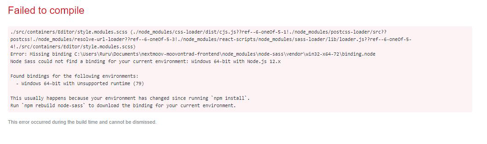

# For Windows users (if you reaaaally can't change to a more UNIX type of material) : Install Node / Yarn / Node SASS

Our conventions include using yarn instead of npm and also SCSS (SASS) instead of CSS. Here are the few steps you'll have to follow to make it work on your marvelous computer.

## Install Node LTS v12

Simply go to [Node's website](https://nodejs.org/en/download/) and download LTS Version's installer package (currently 12.13.0, includes 6.12.0). And run it, of course.
**Warning :** Current version is v13 but Node Sass won't be supported.
See [this link](https://github.com/sass/node-sass/releases/tag/v4.12.0) for more info.

## In Terminal (cmd Shell)

- **node -v** -> to check if Node is successfully installed and **in the right version**,
- **npm -v** -> to check if npm is successfully installed.

## Install Yarn

**Warning :** Do not install Yarn with .exe file from the web or you might have some trouble matching versions. Yarn MUST be installed globally through npm, matching will be done automagically !

##### In Terminal (cmd Shell)

- **npm i -g yarn** -> to install yarn on global,
- **yarn -v** -> to check if yarn is successfully installed.

## Build Yarn in your VS Code project

##### In terminal

- **cmd** -> to send orders from Command Shell instead of PowerShell
- **yarn** -> to install,
- **yarn start** -> to run your project locally,
- **yarn storybook** -> to run your project's storybook.

## If you get a missing binding error

You've tried to emulate your project but instead of your beautiful app, this showed up :

##### In VSCode terminal

- **npm rebuild node-sass**,
- **yarn start**.
